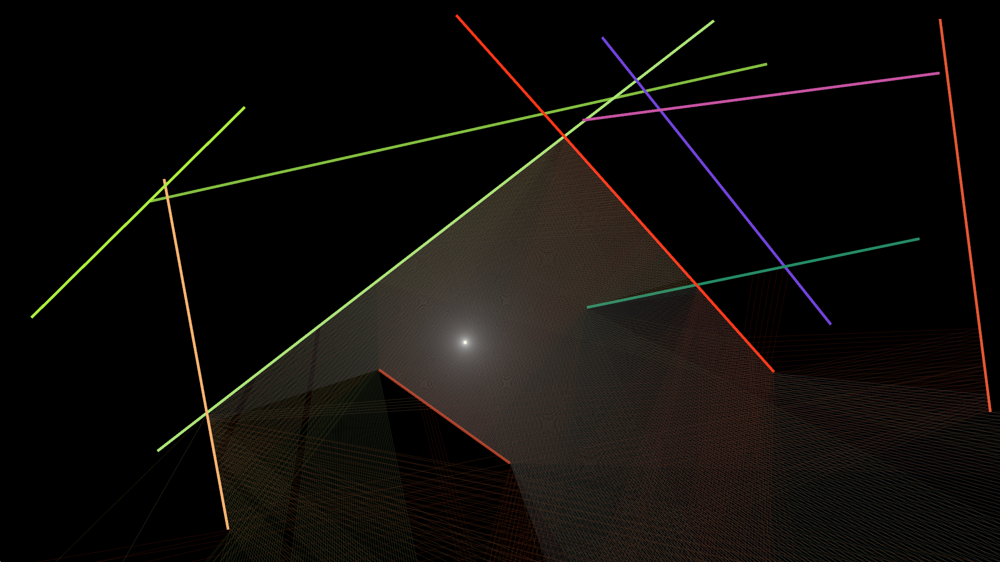
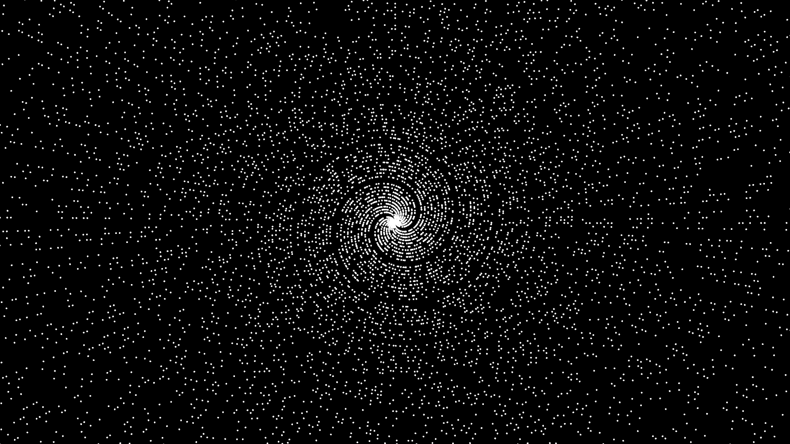
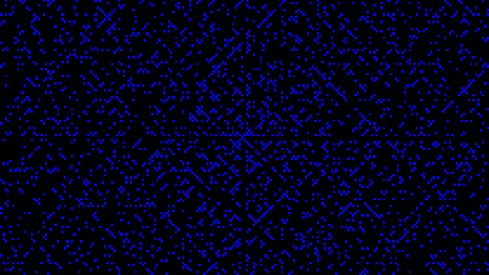

# Coding Challenge
A set of random coding challenges I found interesting. I was inspired by the videos of the youtube
channel called [The Coding Train](https://www.youtube.com/c/TheCodingTrain)

In order  to try the implementations by yourself, you will have to prepare your setup for the use of nannou. You will have to install rust, and probably some [platform-specific setup](https://guide.nannou.cc/getting_started/platform-specific_setup.html)

# Showcases

- [Raycasting 2D](./raycasting-2D/)

Simple 2D raycasting

- [Prime polars](./prime-polars/)

Plot `(n, n)` in polar coordinates. The prime part is irrelevant, but helps making the plot less dense

- [Prime spiral](./prime-spiral/)

Popular prime spiral counting from 0 in the center
