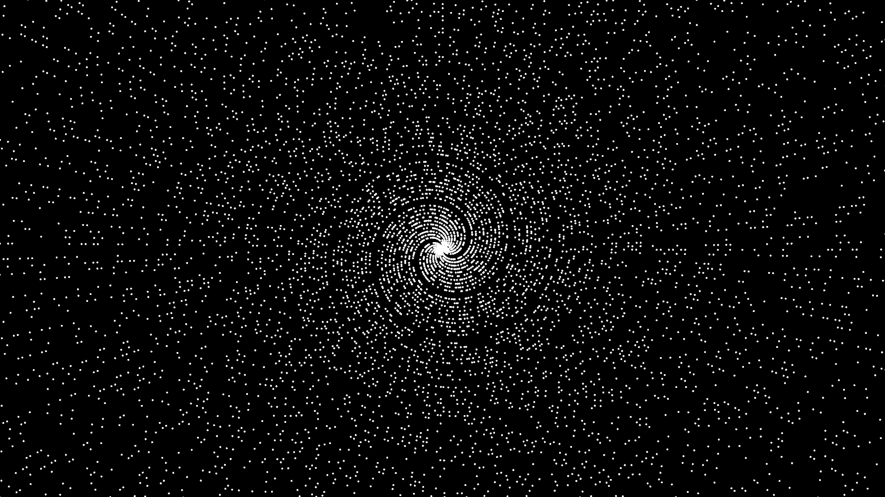

# Objective
Plot `(n, n)` in polar coordinates. The math behind this is very easy even if it looks complicated.

You just have to notice 6 is "pretty close" to `2*Pi`, making 5 spirals. Then any fraction that manages to approach `2*Pi` any closer will look make a better spiral. By zooming out enough the 5 curvy spirals will fade out, and give place for the new ones.

Ploting only primes will make the plot more "readable". Ploting only 1 / 3 of the numbers could also work.

# Usage
- Mouse wheel will zoom in/out