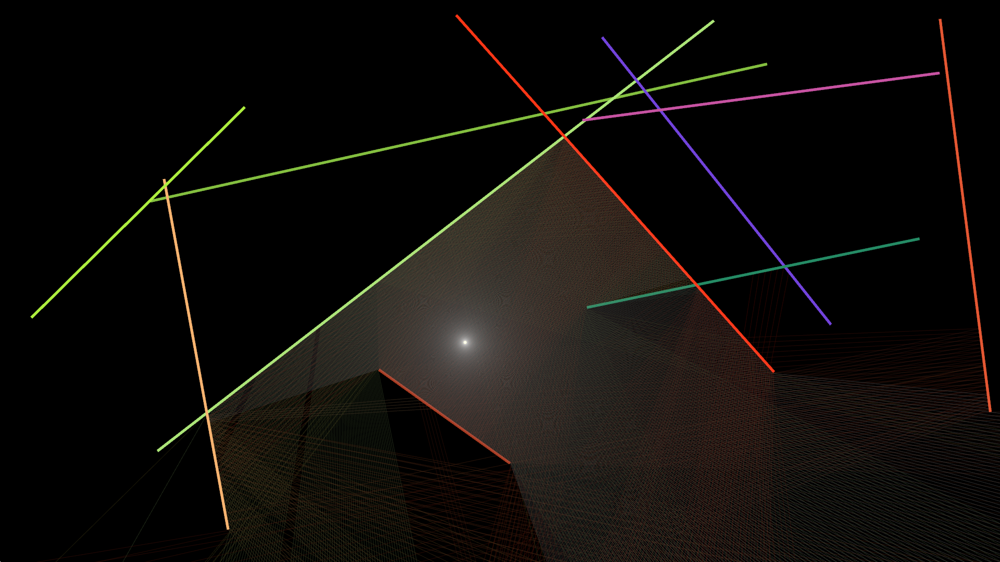

# Objective
Simple 2D raycasting with random walls and color reflection. Movement can be seen on [youtube](https://www.youtube.com/watch?v=upFqbFpj3mg)

# Usage
- The light source will follow the cursor
- Left click/Right click will increase/decrease max reflexions.
- Mouse wheel will modify the total raycount

It is also possible to change the default alpha channel of the rays by changing the RAY_ALPHA constant value in [main.rs](./src/main.rs)